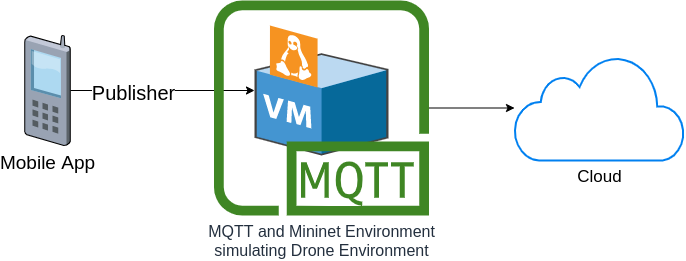
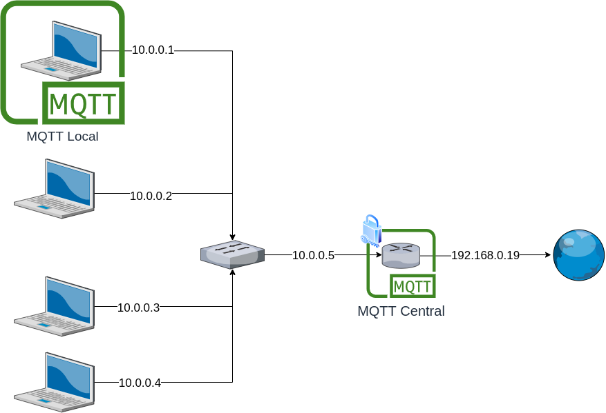
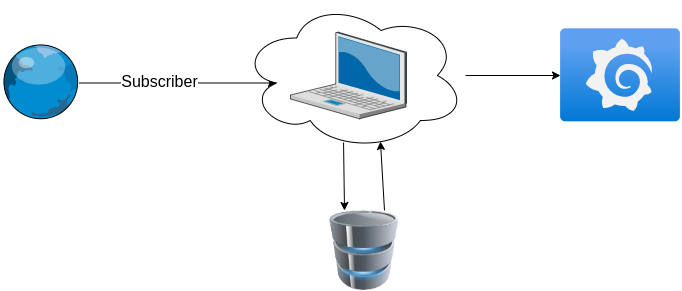

# Documentations

## Videos

### How to do contribution on github

### Network and MQTT Setup Video

### Architecture of the solution IoT

### Integration of Android Application, Mininet and MQTT protocol

## External Files

### Virtual machine with mininet and mqtt

The virtual machine that contains the mininet and the mqtt components can be downloaded from: https://drive.google.com/drive/folders/1TYkj-6eeRgOPq-Uw7VloyoGS9tJ9iR7c?usp=sharing

## Architectures

### General architecture

### Network architecture

### Cloud architecture

